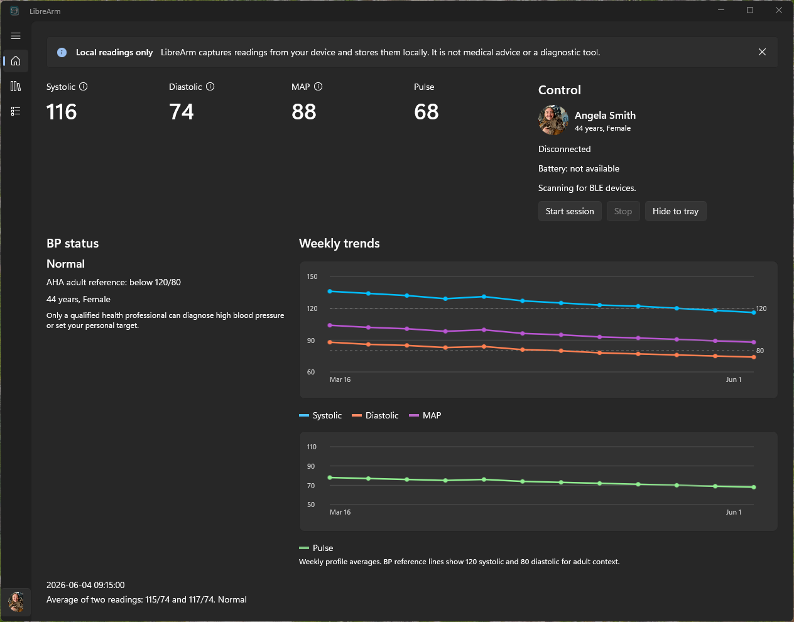
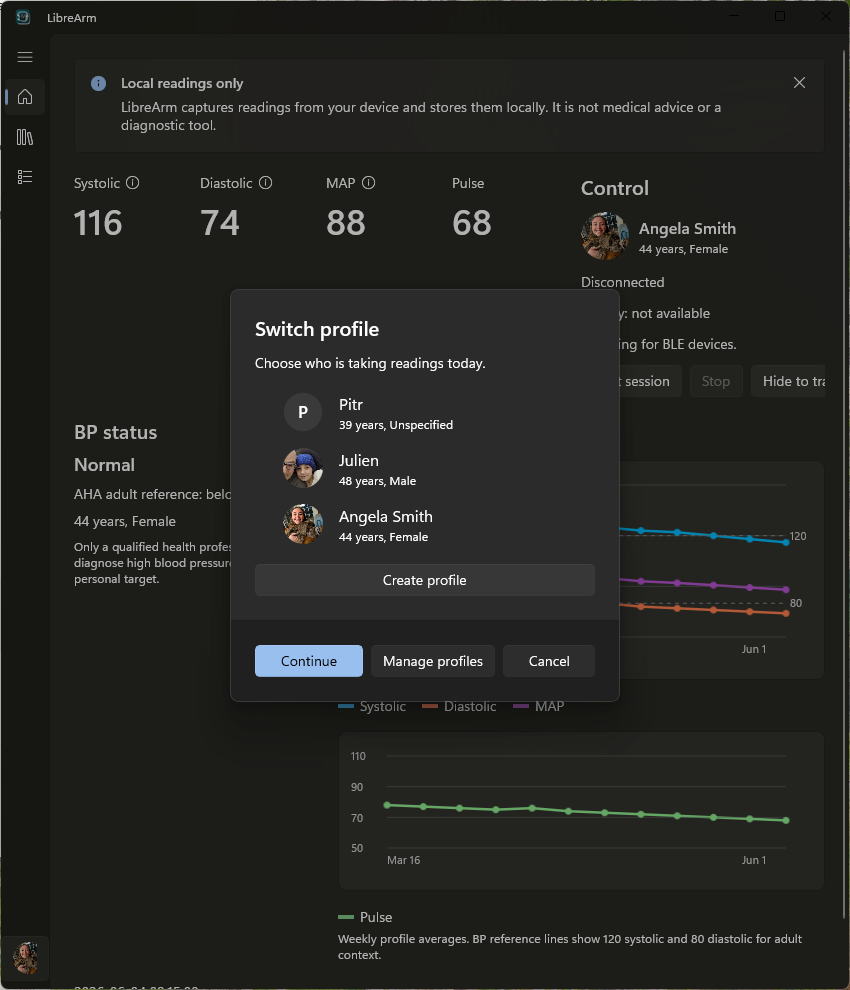
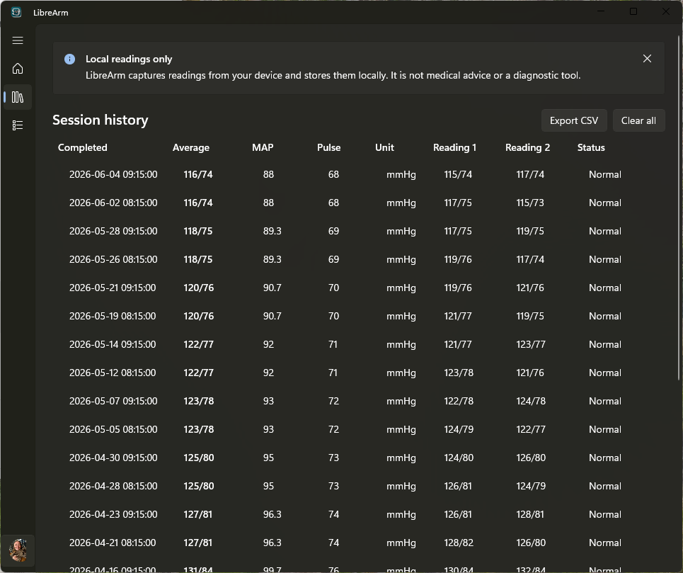
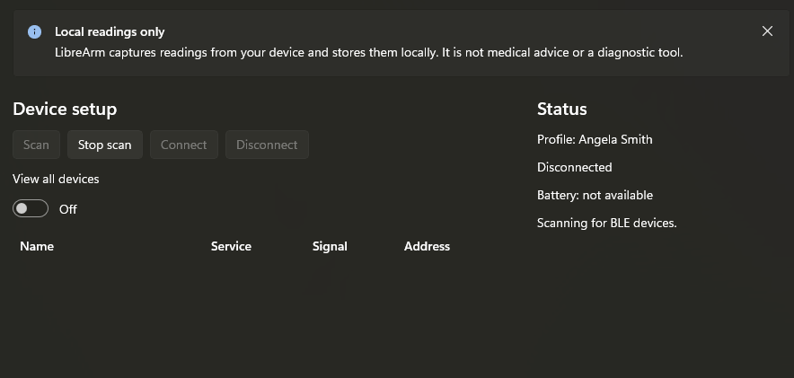
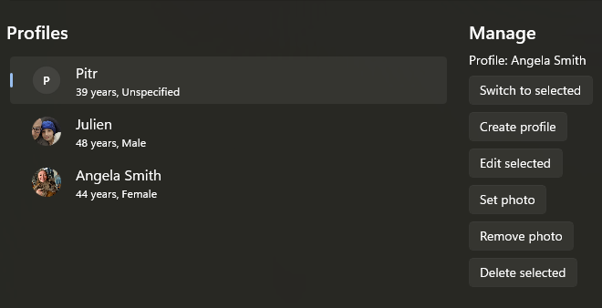

# LibreArm Desktop

LibreArm Desktop is a local/offline WinUI 3 app for reading a QardioArm blood pressure monitor over Bluetooth LE. It uses the standard Blood Pressure service and the known Qardio control characteristic to start and stop measurements.

This is a revival project for restoring local access to readings from hardware you own. It is not affiliated with, endorsed by, sponsored by, or associated with Qardio, QardioArm, or any successor owner of those marks.

This is not a medical device, medical diagnostic tool, or source of medical advice. It captures readings locally from a consumer blood pressure monitor and stores them on your Windows machine. Talk with a qualified health professional before making health decisions from any blood pressure reading.

## Projects

- `src/LibreArm.Core`: protocol constants, blood pressure payload parser, storage, profile/session models, weekly summaries, and adult BP status classification.
- `src/LibreArm.Desktop`: packaged WinUI 3 desktop app, BLE service, tray watcher, profile/session UI, weekly graphs, cropped profile photos, CSV export.
- `tests/LibreArm.Core.Tests`: parser, calculator, classifier, and profile-scoped storage tests.

## Screenshots

### Dashboard



### Profile Switcher



### History



### Device Setup



### Manage Profiles



## Requirements

- Windows 11 with Bluetooth enabled.
- .NET SDK 10.
- Developer Mode enabled for packaged WinUI app registration.

The WinUI template used here targets Windows App SDK `2.1.3` and builds as a single-project MSIX packaged app.

## Build And Test

From the repository root:

```powershell
dotnet restore LibreArm.slnx
dotnet test LibreArm.slnx
dotnet build LibreArm.slnx
```

To explicitly build the desktop app for x64:

```powershell
dotnet build src\LibreArm.Desktop\LibreArm.Desktop.csproj -p:Platform=x64
```

## Run

From the repository root:

```powershell
dotnet run --project src\LibreArm.Desktop\LibreArm.Desktop.csproj
```

The Windows App SDK build tools register and launch the packaged app with package identity. Put the QardioArm into its advertising/wake state, click `Scan`, select the device, then `Connect`. Once connected, `Start` writes `F1 01` and `Stop` writes `F1 02` to the Qardio control characteristic.

On first launch, create a profile with name, birthdate, and biological sex, then connect the device from the Device screen. After a successful connection, LibreArm remembers the shared QardioArm. On later launches, select a profile and LibreArm tries to reconnect to the remembered device while staying visible.

Windows pairing is not expected to be required for the normal QardioArm flow. LibreArm scans for BLE advertisements and connects directly through Windows Bluetooth LE GATT APIs. If a specific Windows machine or device state produces GATT access errors, pairing through Windows Bluetooth settings can still be tried as a troubleshooting fallback, but tested machines have connected through the app without pre-pairing.

The main workflow is a guided two-reading session: the app prompts you to rest, takes one reading, counts down a 60-second rest period, takes a second reading, and saves both readings plus their average. Readings are stored in the packaged app local folder as `librearm-readings.db`. Use `Export CSV` in the app to save a CSV copy. `Clear all` deletes only the active profile's sessions.

The Readings screen shows the latest session average, an adult BP status label, a weekly blood pressure graph, and a separate pulse trend graph for the active profile. Birthdate is used to avoid applying adult categories to children; biological sex is stored with the profile for context and future refinement. Current adult status labels use AHA/ACC-style adult thresholds, which are not sex-specific diagnostic rules.

## Current Workflow

1. Launch the app.
2. Create or select a profile. Profiles include name, birthdate, biological sex, and an optional cropped profile photo.
3. On first setup, connect the QardioArm from the Device screen.
4. Later launches select a profile first, then LibreArm tries the remembered shared device automatically while staying visible.
5. Use `Start session` for the guided two-reading flow.

The guided flow intentionally hides interim BLE samples. Each cuff cycle may produce several candidate payloads; LibreArm saves only the final candidate after the notification stream goes quiet, then averages the two completed readings. History is profile-scoped and lives on its own sidebar screen. Weekly averages are grouped by week for the active profile and shown as trend lines on the Readings dashboard.

Tap or hover Systolic, Diastolic, or MAP labels on the Readings screen for quick context. Launch and sidebar profile switching use the same profile picker. The sidebar profile chip opens quick profile switching and profile management; profile management supports creating, editing, deleting, switching, and setting or removing a cropped profile photo. Photo selection shows a preview, then saves a square center-cropped copy under app-local storage.

## Tray Mode

Use `Hide to tray` on the Readings screen when you want LibreArm to live in the Windows notification area. If a remembered QardioArm exists, LibreArm starts a passive Bluetooth LE advertisement watcher while hidden. When the remembered device advertises, LibreArm throttles connection attempts with 15, 30, then 60 second backoff after failures. On a successful connection, the app opens the Readings dashboard automatically.

The tray menu supports opening LibreArm, pausing or resuming Qardio watch, opening Device setup, opening Profiles, and exiting. Closing the visible window exits the app; tray mode is manual for now.

## Blood Pressure Status

LibreArm displays status for adult profiles using commonly published AHA/ACC adult blood pressure categories:

- Normal: systolic below 120 and diastolic below 80.
- Elevated: systolic 120-129 and diastolic below 80.
- Stage 1 hypertension: systolic 130-139 or diastolic 80-89.
- Stage 2 hypertension: systolic at least 140 or diastolic at least 90.
- Severe range: systolic above 180 or diastolic above 120.

For profiles under 18, LibreArm marks status as pediatric review needed instead of applying adult thresholds. Pediatric blood pressure interpretation can depend on age, sex, and height percentile, so this app does not attempt to diagnose or classify pediatric readings.

## References And Inspiration

Community and reverse-engineering references:

- LibreArm iOS: https://github.com/ptylr/LibreArm
- LibreArm Android: https://github.com/agreenbhm/LibreArm_Android
- QardioArm reverse-engineering notes: https://n0psn0ps.github.io/2025/02/13/Reversing-the-QardioArm/
- CISA Qardio Heart Health / QardioARM A100 advisory: https://www.cisa.gov/news-events/ics-medical-advisories/icsma-25-044-01

Bluetooth and Windows implementation references:

- Bluetooth SIG Blood Pressure Service: https://www.bluetooth.com/specifications/specs/blood-pressure-service-1-1/
- Bluetooth SIG Blood Pressure Profile: https://www.bluetooth.com/specifications/specs/blood-pressure-profile-1-1/
- Microsoft WinUI: https://learn.microsoft.com/windows/apps/winui/
- Microsoft Bluetooth LE GATT client docs: https://learn.microsoft.com/windows/apps/develop/devices-sensors/gatt-client
- Microsoft NotifyIcon docs: https://learn.microsoft.com/dotnet/api/system.windows.forms.notifyicon
- Microsoft single-project MSIX packaging: https://learn.microsoft.com/windows/apps/windows-app-sdk/single-project-msix

AHA/home blood pressure workflow references:

- AHA home blood pressure monitoring: https://www.heart.org/en/health-topics/high-blood-pressure/understanding-blood-pressure-readings/monitoring-your-blood-pressure-at-home
- AHA blood pressure explained: https://www.heart.org/en/health-topics/high-blood-pressure/blood-pressure-explained
- AHA understanding blood pressure readings: https://www.heart.org/en/health-topics/high-blood-pressure/understanding-blood-pressure-readings
- AHA home measurement article: https://www.heart.org/en/news/2020/05/22/how-to-accurately-measure-blood-pressure-at-home
- ACC/AHA 2017 high blood pressure guideline summary: https://www.acc.org/latest-in-cardiology/ten-points-to-remember/2017/11/09/11/41/2017-guideline-for-high-blood-pressure-in-adults%EF%BB%BF

LibreArm's guided two-reading session is inspired by AHA home-monitoring guidance to take two readings one minute apart. Status labels and weekly charts are informational context only; this app does not diagnose hypertension, determine treatment, or replace professional care.

## Known Limits

- The QardioArm protocol behavior is based on community reverse-engineering and observed BLE behavior, not official Qardio documentation.
- The app currently remembers one shared device for all profiles.
- Existing R&D data is intentionally reset when the schema version changes.
- The current adult status labels are based on broad adult thresholds. They are not personalized medical targets, and biological sex is not currently used to change adult category thresholds.
- Profile photos are center-cropped square copies stored in the app's local data folder.
- Tray watch reacts to BLE advertisements from the remembered device; it does not start a measurement automatically.
- BLE reliability depends on Windows Bluetooth state, device wake/advertising behavior, and proximity.
